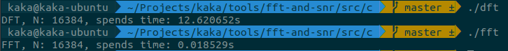
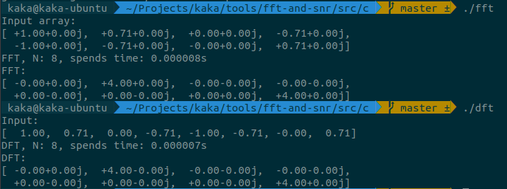

# Fast Fourier Transform

A `Fast Fourier transform (FFT)` is an algorithm that computes the `discrete Fourier transform (DFT)` of a sequence, or its inverse (`IDFT`).

It's let the [complexity of computing](https://en.wikipedia.org/wiki/Computational_complexity_theory) of the Diecrete Fourier Transform (DFT) form O(n^{2}) to `O(nlogn)`.

[Relate knowledge of Fast Fourier Transform](https://github.com/kaka-lin/fft/tree/master/doc)

## Usage

1. Compile

    ```bash
    $ make
    ```

2. Run

    ```bash
    # DFT
    $ ./dft

    # FFT
    $ ./fft
    ```

## DFT v.s FFT

1. spends times

    

2. example

    