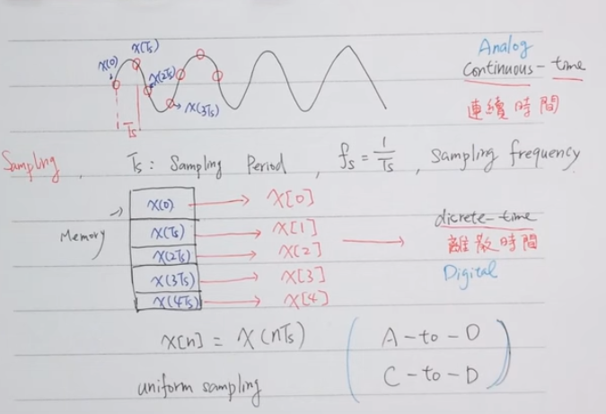
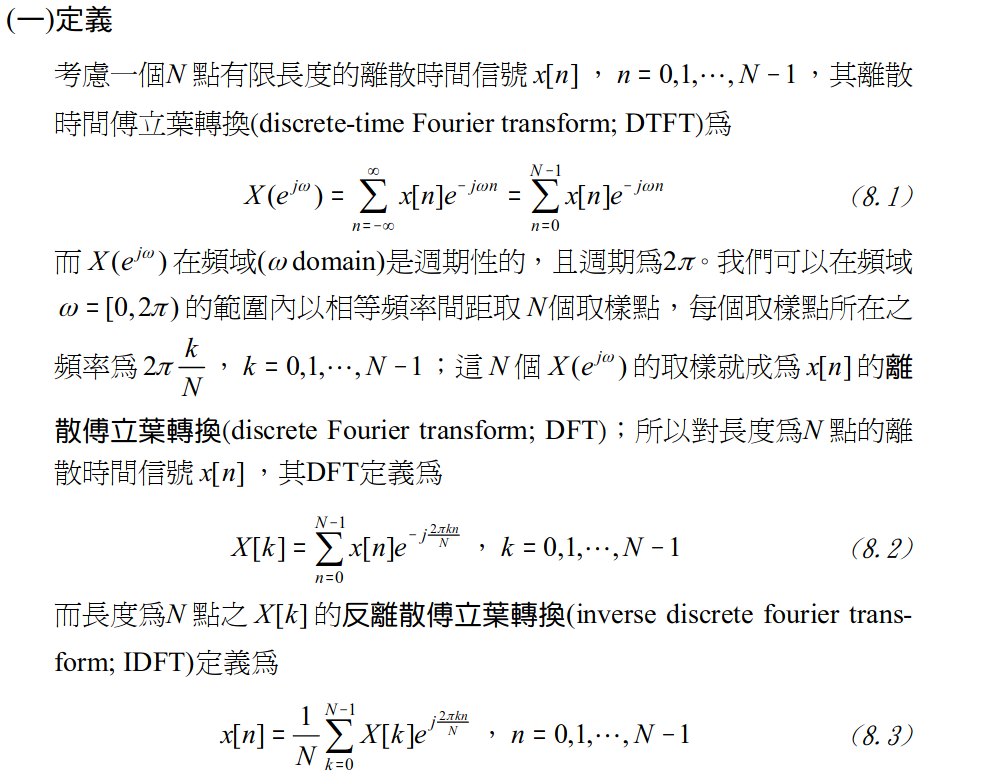
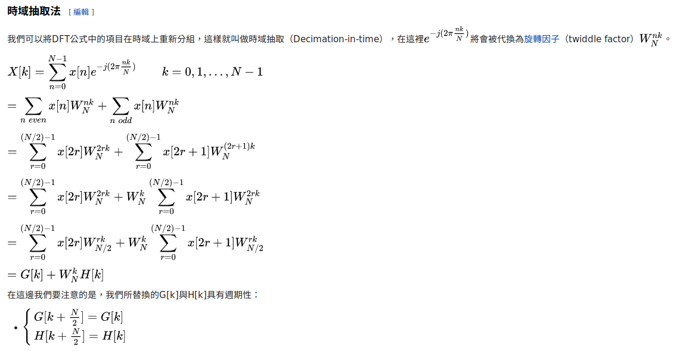

# Relate knowledge of Fast Fourier Transform

- [Sampling Theorem](#sampling)

- [Frequency resolution](#resolution)

- [Discrete Fourier Transform](#dft)

- [FFT Algorithm](#fft)

<span id="sampling"></span>
## Smapling Theorem

Formula: `x(t) = x(nTs) = x[n]`



<span id="resolution"></span>
## Frequency resolution

The `frequency of a point n` is:
    
    Fn = (n-1) * (fs / N)

=> The `Frequency resolution` is:

    Fres = fs / N


<span id="dft"></span>
## Discrete Fourier Transform



DFT就是先將信號在時域離散化，求其連續傅立葉變換後，再在頻域離散化的結果。

```
      sampling                   DFT
x(t) ---------> x(kTs) = x[n] ---------> x[k]
```

<span id="fft"></span>

## Fast Fourier Transform

It has many algorithms.

- Cooley-Tukey algorithm
- Bluestein's algorithm

## Cooley-Tukey algorithm

### Formula



### Butterfly diagram

- [Buffterfly diagram](https://en.wikipedia.org/wiki/Butterfly_diagram)


---

## Ref

1. http://wiki.csie.ncku.edu.tw/embedded/ADC/Sampling_Theorem
2. http://publish.get.com.tw/publish/Control/Pictures/BookPre_pdf/M625A-2.PDF
3. https://dsp.stackexchange.com/questions/15822/how-to-choose-a-fft-algorithm
4. https://en.wikipedia.org/wiki/Cooley%E2%80%93Tukey_FFT_algorithm
5. https://zh.wikipedia.org/wiki/%E5%BA%93%E5%88%A9%EF%BC%8D%E5%9B%BE%E5%9F%BA%E5%BF%AB%E9%80%9F%E5%82%85%E9%87%8C%E5%8F%B6%E5%8F%98%E6%8D%A2%E7%AE%97%E6%B3%95
6. https://en.wikipedia.org/wiki/Butterfly_diagram
7. http://www.csie.ntnu.edu.tw/~u91029/Wave.html#4
